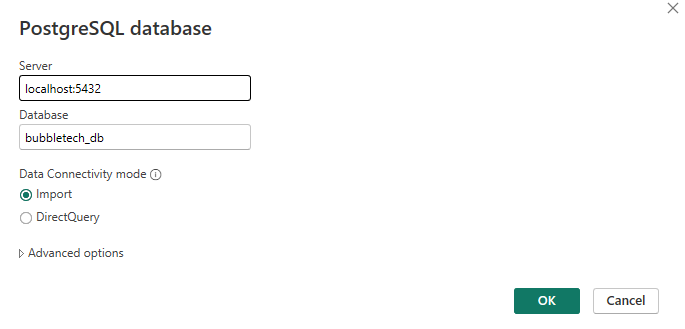

# 📊 Dashboards Power BI – Projet BubbleTech

## 🎯 Objectifs du rapport Power BI

La direction de BubbleTech exprimait un besoin clair : disposer d’une **vision consolidée, fiable et interactive** sur ses activités.

Avant ce projet, les données étaient réparties dans plusieurs fichiers Excel. Il était difficile d’avoir une **vue d’ensemble rapide**, de suivre l’évolution des indicateurs clés, ou de comparer les profils des bénéficiaires.

Le rapport Power BI permet aujourd’hui de :
- Piloter l’activité des stagiaires, bénévoles, formateurs, partenaires,
- Visualiser la répartition des profils et des disponibilités,
- Analyser la satisfaction, les domaines de collaboration, et l’impact des actions,
- Suivre la qualité des données collectées pour assurer la fiabilité des décisions.

En résumé : ce rapport est un **outil d’aide à la décision**, pensé pour la direction, construit à partir de données terrain, et mis à jour en continu pour refléter la réalité de terrain.
---

## 🔗 Connexion à la base de données PostgreSQL

Le rapport Power BI est connecté à une base de données locale PostgreSQL (`localhost:5432`) contenant les vues SQL nécessaires à l’analyse.

La base `bubbletech_db` héberge un ensemble de vues préconstruites (ex. `vue_stagiaire`, `vue_partenaire`, `vue_satisfaction_globale`, etc.), déjà nettoyées, structurées, et prêtes à l’usage.

🛠️ Le mode de connexion utilisé est **Import**, ce qui permet de charger les données localement pour assurer des performances fluides, sans latence au filtrage ni à l’interaction.

📸 Exemple de connexion Power BI :

💡 Ce choix permet une **séparation claire des responsabilités** :
- Le nettoyage et la structuration sont faits en amont, dans la base,
- Power BI se concentre uniquement sur la modélisation, les mesures DAX, et la visualisation.

  ---

## 🧩 Modèle relationnel Power BI

Le rapport Power BI repose sur un **modèle relationnel clair et segmenté par rôle**, construit à partir de **vues SQL optimisées**.  
Chaque vue correspond à une entité métier : stagiaire, formateur, partenaire, etc., ce qui permet une lisibilité accrue, une meilleure performance et une maintenance facilitée.

---

### 🗂️ Exemple 1 : Vue Partenaire

La vue `partenaire` est reliée à plusieurs entités secondaires :
- `type` de partenariat
- `format` de collaboration
- `ressources partagées`
- `disponibilité horaire`
- `domaines d’intervention`

👉 Cette structuration permet de filtrer dynamiquement les partenariats selon différents critères.

---

### 🗂️ Exemple 2 : Vue Stagiaire

La table `Stagiaire` centralise toutes les informations liées au profil :  
âge, genre, modalités de stage, réseau social, etc.

Elle est reliée à deux tables :
- `stagiaire_disponibilite` : un stagiaire peut avoir plusieurs créneaux disponibles (relation 1:N)
- `stagiaire_formation` : chaque stagiaire est associé à une formation unique (relation 1:1 dans ce projet)

🔐 Certaines colonnes sensibles (linkedin, instagram…) ont volontairement été masquées dans le modèle pour illustrer la bonne gestion de la confidentialité dans le rapport.

---

### 🧠 Autres vues utilisées (non affichées ici) :

| Vue                     | Rôle couvert                    |
|--------------------------|---------------------------------|
| `formateur`              | Intervenants pédagogiques       |
| `employe`                | Équipe interne                  |
| `benevole`               | Profils engagés ponctuellement  |
| `satisfaction_globale`   | Résultats d’évaluation des formations |
| `mesures`                | Table centrale DAX (KPI)        |

---

🎯 Ce découpage en vues thématiques assure :
- Un modèle propre et modulaire
- Un filtrage logique (ex : 1 stagiaire ➝ plusieurs créneaux)
- Une séparation des responsabilités entre base de données et reporting

